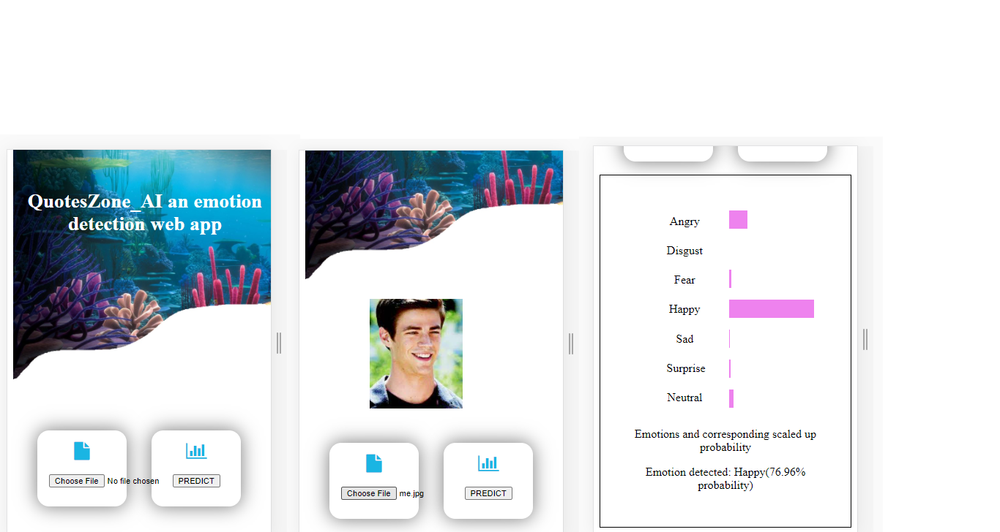
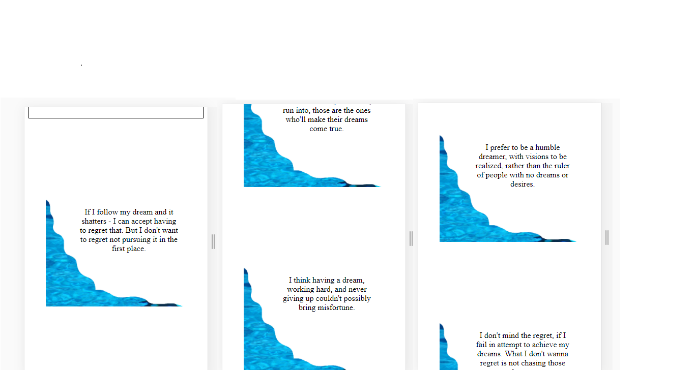
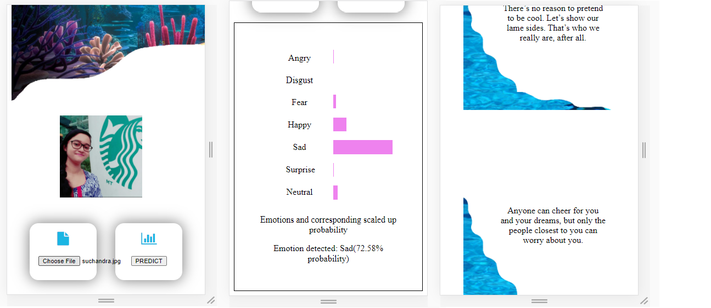

**QuotesZone_AI an emotion detection web app**

A web app accessed from web browsers that predicts emotion from images uploaded to it and displays quotes based on the emotion detected. Tech used: Python, Keras API, Tensorflowjs, JavaScript and Firebase.
Based on different Convolutional Neural Network architectures, a model is trained using Python, Keras API, with fer2013 dataset on Google Colaboratory GPU's. The Keras SavedModel is converted to tfjs layers format, loaded and infered in browser using Tensorflow.js and this entire thing is hosted on Firebase. Tfjs converter doesnt work in Colab if input model path is in Drive as the space in "My Drive" part of filepath seems to be causing some problem(refer tfjs issues #3618, uploading model via file upload into local drive works)

Sample predictions and output
For best results, view on mobile devices. Not fully responsive for larger screens and desktops.

